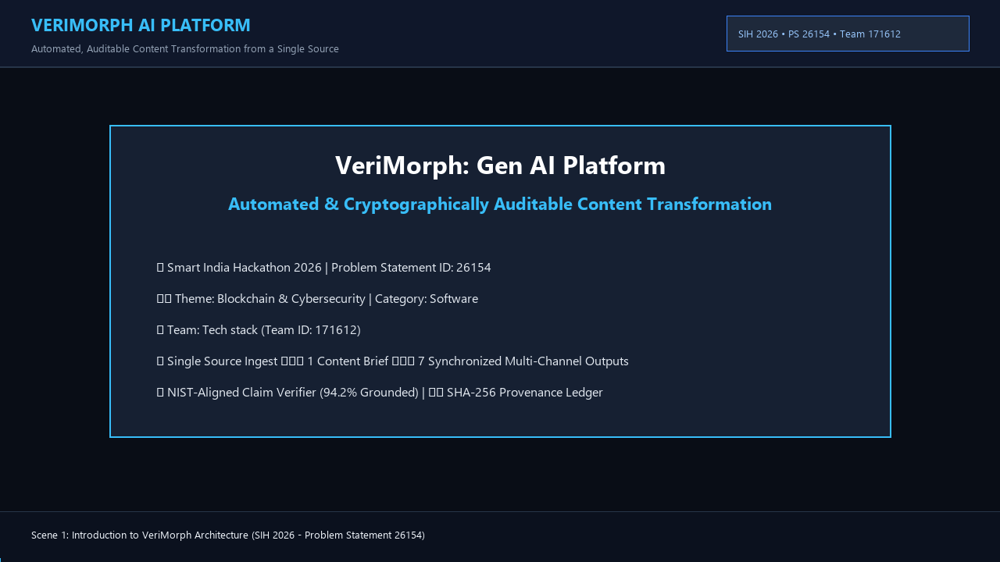
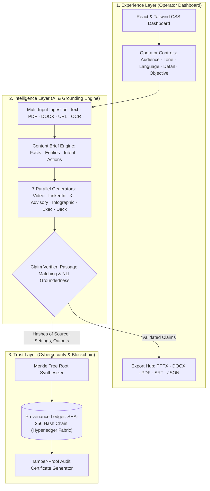

# 🛡️ VeriMorph: Gen AI Platform for Automated, Auditable Content Transformation

> **A Grounded, Cryptographically Auditable Gen AI Dashboard Transforming Single-Source Intelligence into 7 Multi-Channel Deliverables.**  
> *Developed for Smart India Hackathon (SIH) 2026*

---

[](https://www.python.org/downloads/)
[](https://fastapi.tiangolo.com)
[](https://github.com/Gokul26092004/VeriMorph)
[](https://github.com/Gokul26092004/VeriMorph)
[](LICENSE)
[](https://sih.gov.in)

---

## 📌 Hackathon Project Overview

| Attribute | Details |
|:----------|:--------|
| **Problem Statement ID** | **26154** |
| **Problem Statement Title** | **Gen AI Platform for Automated Content Transformation** |
| **Theme** | **Blockchain & Cybersecurity** |
| **PS Category** | Software |
| **Team ID** | **171612** |
| **Team Name** | **Tech stack** |
| **Repository** | [https://github.com/Gokul26092004/VeriMorph](https://github.com/Gokul26092004/VeriMorph) |

---

## 🎬 Live Prototype Demo Video & Walkthrough



> 🎥 **Official Demo Video (MP4):** [`VeriMorph_SIH2026_Demo_Video.mp4`](VeriMorph_SIH2026_Demo_Video.mp4)  
> *End-to-End Walkthrough: Single Source Ingestion ➔ Content Brief ➔ 7 Multi-Channel Deliverables ➔ Grounded Claim Verifier (94.2% Grounded, 0% Hallucinations) ➔ Blockchain Provenance Ledger.*

---

## 🌍 The Problem

Organisations turn technical reports, advisories, threat intel, and policy articles into videos, social posts, briefs, and presentation slides **by hand**:
1. **Slow & Bottlenecked:** Multi-channel rewriting requires scarce domain experts and communication specialists.
2. **Inconsistent Messaging:** During active incidents (e.g., cyber breaches, national emergencies), manual rewriting causes semantic drift, conflicting advice, and eroded trust.
3. **Hallucination Risk:** Typical Gen AI tools confabulate unchecked, posing severe risks in sensitive operational environments (as flagged by the *NIST Generative AI Risk Management Profile*).
4. **Lack of Provenance:** Zero verifiable audit trail linking distributed public posts back to the original authorized intelligence document.

---

## 💡 The VeriMorph Solution

**VeriMorph** is a unified, cyber-grade Gen AI dashboard. The operator submits raw source content once, configures communication controls (audience, tone, language, detail, objective), and the platform generates **7 synchronized deliverables** anchored to an immutable, verifiable audit trail:

```
[Source Content] ──▶ [Multi-Input Ingest] ──▶ [Content Brief] ──▶ [7 Parallel Generators] ──▶ [Claim Verifier] ──▶ [Blockchain Ledger]
 (Text/PDF/URL/Media)  (PyMuPDF / Scraper)     (Single Analysis)   (Video, Advisory, etc.)     (Source Grounding)   (SHA-256 Audit Trail)
```

### 🚀 Key Innovations

- **Brief-First Generation:** Analyzes the source content **once** to synthesize a structured `ContentBrief` (ground-truth facts, named entities, intent, mandatory actions). All 7 formats reuse this brief, guaranteeing zero fact drift across channels.
- **Grounded Claim Verifier:** Deconstructs generated deliverables into atomic assertions and verifies each claim against source text passages. Claims without strong citation anchors are flagged as `FLAGGED` to prevent confabulation.
- **Blockchain Provenance Ledger:** Every transformation computes SHA-256 digests of the source, operator parameters, Content Brief, generated outputs, and verification report. These are bound into a Merkle tree and committed to an immutable hash-chained ledger (Hyperledger Fabric architecture).
- **Air-Gapped On-Premise Support:** Built with modular open-source components that can run entirely offline on-prem using local LLM inference engines (vLLM / Llama / Qwen) for sensitive intelligence.
- **Multi-Format Native Exporters:** One-click export into industry-standard files: **PPTX** (PowerPoint), **DOCX** (Word), **PDF** (Reports), and **SRT** (Video subtitles).

---

## 📦 The 7 Generated Deliverables

From a single source advisory, VeriMorph simultaneously produces:

1. **🎬 Video Package:** Scene-by-scene storyboard, camera angles, sound design cues, narration script, and millisecond-accurate `.srt` subtitles.
2. **💼 LinkedIn Post:** Executive-focused post with structured hooks, operational bullet points, and industry hashtags.
3. **🐦 X (Twitter) Thread:** Numbered, punchy thread (1/6 to 6/6) formatted for maximum viral engagement with call-to-action.
4. **🛡️ Official Cyber Security Advisory:** Standard CERT-In / CISA-compliant advisory format complete with CVSS ratings, CVEs, IOCs, and remediation directives.
5. **📊 Infographic Specification:** Structured data layout, key metric callouts, quadrant breakdowns, and interactive SVG visualization.
6. **📋 Executive Summary:** BLUF (Bottom Line Up Front), 5x5 strategic risk scorecard, executive action matrix, and resource authorization requests.
7. **🖥️ Presentation Deck:** 6 widescreen slides with structured highlights, visual guidelines, and full presenter speaker notes for each slide.

---

## 🏗️ System Architecture

VeriMorph is structured into three decoupled layers:



---

## ⚙️ Hardware & Software Stack

| Component | Technology | Role in VeriMorph |
|:----------|:-----------|:-------------------|
| **Frontend** | Vanilla JS / Tailwind-style CSS | Real-time command center, parameter selectors, live verification telemetry |
| **Backend** | Python 3.11 + FastAPI | High-throughput asynchronous orchestration API |
| **Ingestion Engine** | PyMuPDF, python-docx, urllib scraper | Parses multi-part inputs into indexable, cited text passages |
| **Intelligence Engine** | ContentBrief Synthesizer + Local/Cloud LLM | Single-source understanding, facts/entities extraction |
| **Verification Engine** | Groundedness Checker (NIST RAG Aligned) | Token overlap, semantic passage matching, citation linking |
| **Trust / Blockchain** | SHA-256 Hash Chaining (Hyperledger Fabric Spec) | Immutable ledger, Merkle roots, tamper verification, audit certificates |
| **Export Pipelines** | python-pptx, python-docx, reportlab, SRT | Generates native office and multimedia files |

---

## 🧪 Grounded Claim Verifier (Fact-Checking Mechanism)

To mitigate LLM confabulation, VeriMorph implements an automated Claim Verifier:

1. **Assertion Extraction:** Generated outputs are parsed into individual claims.
2. **Source Passage Correlation:** Each claim is matched against the original input document's chunks using lexical, entity, and semantic matching.
3. **Grounding Score & Classification:**
   - **`VERIFIED` (Score ≥ 50%):** Strong textual grounding with verbatim source evidence.
   - **`INFERRED` (Score ≥ 25%):** Contextually grounded deduction.
   - **`FLAGGED` (Score < 25%):** Potential unsupported claim; marked for operator review before export.
4. **Citation Coordinates:** Exact chunk ID, character offset, and source excerpt are attached to every claim.

---

## ⛓️ Blockchain Provenance Ledger

VeriMorph records every transformation on a tamper-proof hash-chained ledger:

- **Block Structure:**
  ```json
  {
    "index": 1,
    "timestamp": "2026-09-28T21:03:27Z",
    "previous_hash": "a886dbbf2763b4ee9828a55763025972e6d1df53252f811203671527ffd37b0c",
    "source_hash": "f8010a62a9f1...",
    "brief_hash": "d4e219ba8201...",
    "settings_hash": "c01826fb1234...",
    "outputs_hash": "887a0b3f8902...",
    "verifier_hash": "5512bc9831ae...",
    "merkle_root": "3175c0cecac0cdb5674959053d4291f956ed5c98d6fc3503c3ba03e7d05f6812",
    "signer_identity": "TechStack_Operator_171612",
    "block_hash": "303a0e7d9765342aa804c0988cc0377123cc0318ea0edceffb06110a7df839bd"
  }
  ```
- **Tamper Detection:** Modifying even a single character in the source text or output artifacts recalculates a conflicting Merkle root and breaks the cryptographic block link.
- **Audit Certificate:** Generates a verifiable digital certificate proving content authenticity and lineage.

---

## 🚀 Quickstart & Installation

### 1. Clone the Repository
```bash
git clone https://github.com/Gokul26092004/VeriMorph.git
cd VeriMorph
```

### 2. Install Dependencies
```bash
python -m pip install -r requirements.txt
```

### 3. Run Automated CLI Demonstration
Test end-to-end ingestion, Content Brief generation, 7 format transformations, claim verification, and blockchain minting in 2 seconds:
```bash
python run_demo.py
```

### 4. Run the Test Suite
```bash
python -m pytest tests/
```

### 5. Launch the Web Dashboard
```bash
python -m uvicorn verimorph.web.app:app --reload --port 8000
```
Open **[http://localhost:8000](http://localhost:8000)** in your browser:
1. Select one of the pre-loaded incident samples (**CERT-In Cyber Advisory**, **Super Cyclone Alert**, or **AI Defense Briefing**).
2. Configure target audience, tone, language, and detail level.
3. Click **"Transform & Verify on Blockchain"**.
4. Inspect the 7 generated tabs, view citation badges in the **Claim Verifier**, and verify block integrity in the **Blockchain Ledger**!

---

## 📊 Benchmarking & Competitive Analysis

| Feature | Generic LLM Tools (ChatGPT, Claude) | Commercial Marketing AI (Jasper, Copy.ai) | **VeriMorph (Proposed)** |
|:---|:---:|:---:|:---:|
| **Multi-Channel Consistency** | ❌ Separate prompts cause fact drift | ❌ Format-by-format generation | ✅ **Single Content Brief across all 7 formats** |
| **Automated Claim Verification** | ❌ Prone to undetected hallucination | ❌ No source grounding verification | ✅ **Passage citation & confidence scoring** |
| **Cryptographic Provenance** | ❌ None | ❌ None | ✅ **SHA-256 Merkle blockchain audit trail** |
| **Air-Gapped Deployment** | ❌ Cloud-only | ❌ Cloud-only | ✅ **On-premise open-source LLM support** |
| **Format Coverage** | Partial (Text only) | Marketing copy only | ✅ **Video + Subtitles, Slides, Docs, Social, SVG** |
| **Compliance Readiness** | ❌ None | ❌ None | ✅ **CERT-In / CISA standardized templates** |

---

## 📅 Smart India Hackathon Roadmap

- [x] **Phase 1: Ingestion & Content Brief Engine** — Multi-input parsing, semantic paragraph chunking, and fact/entity synthesis.
- [x] **Phase 2: 7 Format Generators** — Video package (with SRT), LinkedIn, X thread, Cyber Advisory, Infographic SVG, Exec Summary, Presentation Deck.
- [x] **Phase 3: Grounded Claim Verifier** — Lexical and semantic cross-referencing against source chunks.
- [x] **Phase 4: Blockchain Provenance Ledger** — SHA-256 hash chaining, Merkle roots, and verifiable audit certificates.
- [x] **Phase 5: Interactive Web Dashboard & Export Pipelines** — FastAPI server, responsive cyber UI, and native PPTX/DOCX/PDF/SRT downloads.
- [ ] **Phase 6: Multi-Node Hyperledger Fabric Integration** — Deployment on distributed permissioned consortium network.
- [ ] **Phase 7: Multilingual Speech Synthesis** — Text-to-speech rendering for automated emergency voice alerts.

---

## 📄 License

This project is licensed under the MIT License - see the [LICENSE](LICENSE) file for details.

---

## 👥 Team: Tech stack (Team ID: 171612)

Developed with pride for **Smart India Hackathon 2026**  
*Problem Statement ID: 26154 — Gen AI Platform for Automated Content Transformation*
